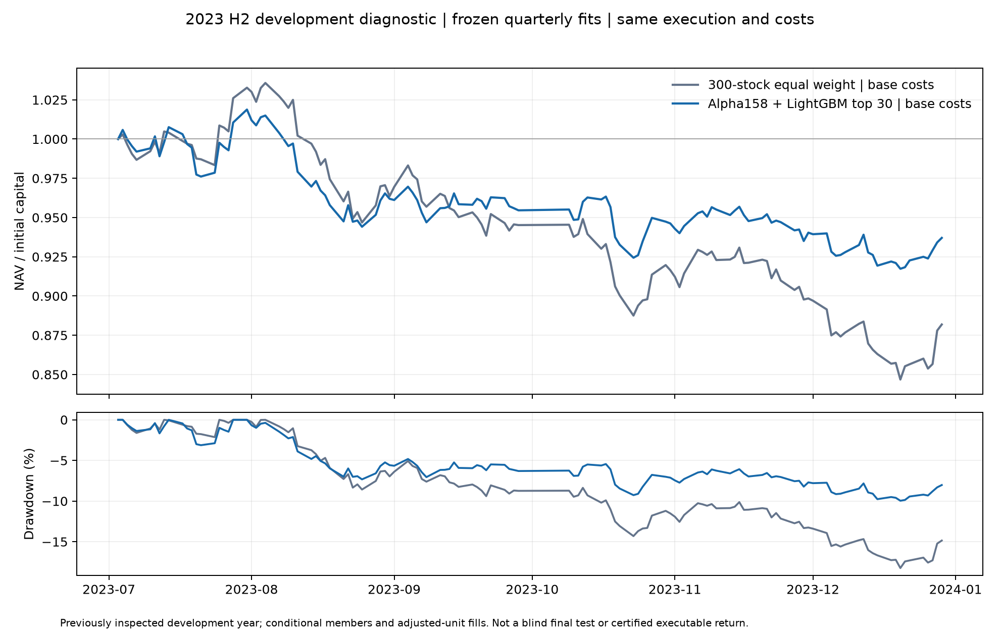

# Alpha158 + LightGBM：2023 年下半年诊断

模型确实改善了同期等权组合，但仍然亏损。2023-07-03 至 2023-12-29 的常规成本结果是：

| 组合 | 区间收益 | 年化收益 | 最大回撤 | Sharpe（无风险利率为 0） | 双边累计换手 |
| --- | ---: | ---: | ---: | ---: | ---: |
| 300 只条件成员等权 | -11.81% | -22.71% | 18.24% | -1.828 | 167.91% |
| Alpha158 + LightGBM top30 | **-6.30%** | -12.47% | **9.96%** | -1.196 | 2,446.52% |

top30 相对同期等权改善 **5.52 个百分点**，回撤减少 8.28 个百分点；但最终资产仍从
1,000 万元降至约 9,371,903 元，不能称为盈利策略。模型的零成本结果也为 **-3.67%**，
所以亏损并非完全由手续费造成。

三个成本场景的完整结果如下。两种组合使用同一 124 个交易日、相同初始资金、同一成员
输入和相同执行规则；模型只把每日目标股票池换成预测分数最高的 30 只。

| 成本场景 | 组合 | 区间收益 | 年化波动 | 最大回撤 | 费用加滑点 |
| --- | --- | ---: | ---: | ---: | ---: |
| 零成本 | 等权 | -11.35% | 13.58% | 17.95% | 0 元 |
| 零成本 | top30 | **-3.67%** | 10.75% | **8.10%** | 0 元 |
| 常规成本 | 等权 | -11.81% | 13.58% | 18.24% | 49,540 元 |
| 常规成本 | top30 | **-6.30%** | 10.67% | **9.96%** | **265,713 元** |
| 较高成本 | 等权 | -12.26% | 13.58% | 18.52% | 96,847 元 |
| 较高成本 | top30 | **-8.13%** | 10.64% | 11.38% | **451,168 元** |

top30 的预测排序具有一定方向性：全评估期平均 IC 为 0.084，平均 Rank IC 为 **0.108**，
Rank IC 为正的交易日占 77.1%。Q3 平均 Rank IC 0.097，Q4 为 0.121。不过 top30 的
双边换手约为等权的 **14.57 倍**，常规成本约 26.6 万元，约为初始资金的 2.66%；
这把零成本的 -3.67% 拉低到 -6.30%。这说明目前的预测排序有信号，但组合构造和交易成本
仍然没有形成正的净收益。

模型和边界在查看本次收益之前固定于
[alpha158-lightgbm-2023-diagnostic.json](../configs/alpha158-lightgbm-2023-diagnostic.json)。
使用 Qlib 0.9.7 原生 `Alpha158DL.get_feature_config()` 的 158 个表达式，过去 60 个交易日
作为预热，不做全样本拟合的标准化。目标是信号日 `t` 的
`open[t+6] / open[t+1] - 1`，只在信号日条件成员且两个端点有效时计算；训练目标是该日
成员内 `average_rank(pct=True) - 0.5`。特征、标签和模型都没有读取 2024–2025。

按预先固定的扩展训练窗口执行两次 LightGBM 拟合：

| 窗口 | 训练信号范围 | 最晚成熟标签 | 拟合时点 | 预测范围 | 训练行数 |
| --- | --- | --- | --- | --- | ---: |
| 2023Q3 | 2023-04-04 至 2023-06-20 | 2023-06-30 | 2023-06-30 收盘 | 2023-07-03 至 2023-09-28 | 15,592 |
| 2023Q4 | 2023-04-04 至 2023-09-20 | 2023-09-28 | 2023-09-28 收盘 | 2023-10-09 至 2023-12-29 | 34,791 |

训练严格要求 `label_exit_index < evaluation_start_index`，未成熟标签不进拟合。固定参数为
150 棵树、学习率 0.05、15 个叶子、最小叶节点 200、`reg_lambda=1`、随机种子 20261004，
无 early stopping、无超参数搜索、无多种子筛选。每个预测日只在当日条件成员、收盘价有效且
有模型输出的股票中按分数降序选 30 只，同分按代码升序。季度切换时连续持仓，不做期末强平。

回测仍沿用首份等权诊断的调整单位和简化成交假设：信号收盘冻结目标数量，下一交易日开盘
执行；买卖滑点、佣金、过户费和卖出印花税按冻结成本配置计算；已知全天停牌阻止成交。
没有完整 ST、涨跌停和容量数据，因此结果仍不是可直接交易的净收益。

独立审计从保存的 158 维特征、标签、训练 mask、LightGBM 文本模型、预测和成交记录重算：

- 两窗原生特征、未来扰动、ROC60 预热和缺值处理测试通过；模型模块 7 项专测通过。
- runner 和旧执行内核共 16 项专测通过；Ruff、格式和差异检查通过。
- 保存的模型重新加载后预测最大误差为 0；训练行、特征 hash、标签 hash 与 manifest 一致。
- 独立核对确认两窗没有使用评估标签，top30 每个预测日的成员过滤和排序一致。
- 两种组合的零成本、常规成本和较高成本每日现金、持仓、费用、净值与成交记录对账通过。

这仍是 2023 年开发诊断区间，不能作为最终封存测试；2023 年等权结果已经查看，模型结果
也不能被称为盲测。真实候选的历史可用时间、成员完整性、复权方法、ST / 涨跌停 / 容量、
公司行为和正式 PIT 资格仍未完成认证。没有官方沪深 300 指数基准，所以这里只比较匹配的
条件成员等权控制组合。

完整产物约 56 MB，位于
`artifacts/experiments/diagnostic/alpha158-lightgbm-2023-h2-v1/`，包含本地 Qlib provider、
158 维特征、两个模型文本、训练证据、预测与标签、每日 IC、两种组合的三档成本订单 / 成交 /
持仓 / 日净值、净值图、manifest 和独立审计。紧凑证据见
[alpha158_lightgbm_2023_acceptance.json](evidence/alpha158_lightgbm_2023_acceptance.json)。

本次运行从干净提交 `2839a63264d4d0f5869e7b97bde81b2d5ffcd29f` 开始，CPU 执行约 32 秒，
没有网络、服务器或 GPU 任务。下一步应先在数据认证与组合构造层处理换手和成本，再扩大
历史覆盖；不能根据这一次 2023 诊断结果继续调参并把改善当成已验证收益。

固定 MLP 对照随后记录于 [MLP 诊断报告](MLP_ALPHA158_2023_DIAGNOSTIC.md)；它的常规成本收益
为 -9.00%，未超过本报告的 LightGBM 结果。
