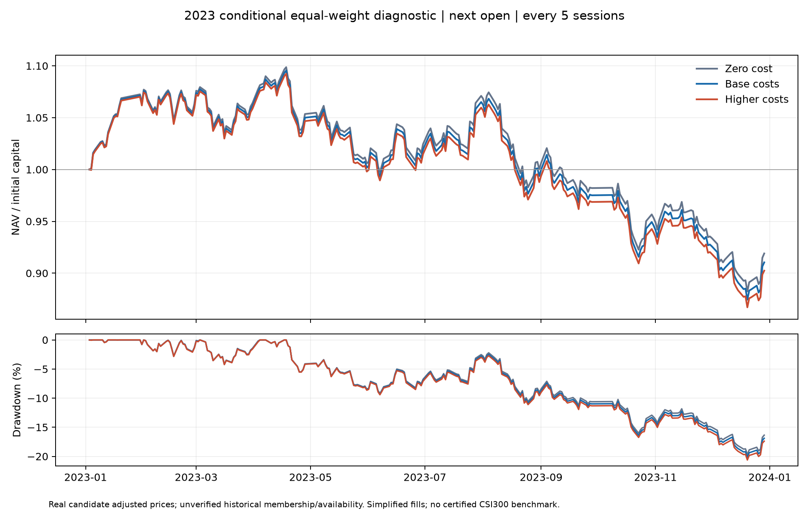

# 2023 年真实候选数据等权回测

已实际完成第一份真实价格诊断回测：2023 年常规成本后收益 **-8.96%**，最大回撤
**20.17%**。这一结果用于检查等权基线、时序和成本敏感性，历史可得时间、成员完整性
和实际可成交条件仍未认证，全部原始候选继续保留 `research_eligible=false`。

此前把正式数据认证作为所有回测的前提，推迟了首份结果；本批采用事前声明的诊断假设
跑出结果，同时保留正式研究门禁。没有根据收益更换区间、股票池、成本或策略参数。

| 指标 | 零成本 | 常规成本 | 较高成本 |
| --- | ---: | ---: | ---: |
| 区间收益 | -8.10% | **-8.96%** | -9.76% |
| 年化收益 | -8.45% | -9.35% | -10.18% |
| 年化波动 | 13.38% | 13.39% | 13.40% |
| Sharpe（无风险利率为 0） | -0.593 | -0.666 | -0.735 |
| 最大回撤幅度 | 19.69% | **20.17%** | 20.62% |
| 期末资产（元） | 9,189,878.57 | 9,103,891.40 | 9,023,954.85 |
| 费用加滑点（元） | 0.00 | 94,513.38 | 182,298.74 |
| 双边累计换手 | 250.77% | 250.79% | 250.82% |
| 调仓执行日数 | 49 | 49 | 49 |
| 成交笔数 | 14,722 | 14,722 | 14,722 |



输入是已经保留的社区历史包候选行情、按选定公告重建的条件成员及停牌参考。2023-01-03
至 2023-12-29 共 242 个交易日，行情覆盖 336 只证券；每天条件成员 300 只，全年并集
323 只。原始文件摘要在运行前后均匹配，未重新请求供应商，也未读取 2024–2025 行情。

策略和成本在查看本次收益之前固定于
[diagnostic-equal-weight-2023.json](../configs/diagnostic-equal-weight-2023.json)，
冻结提交 `a89bf85`。初始现金 1,000 万元，目标投资比例 99%，不加杠杆、不做空。
信号日使用当天收盘净资产和收盘价格确定等权目标数量，每 5 个交易日产生一次信号；
首个信号是 1 月 3 日收盘，首笔成交是 1 月 4 日开盘，末次成交为 12 月 29 日。

开盘先卖后买。现金不足时，买入按代码顺序缩减至可负担数量，该顺序可能产生分配偏差；
即使零成本也可能受跳空和现金限制。未成交订单当天失效。本次三个场景实际均全部成交，
没有现金不足或停牌拒单；有 **1 个信号目标因缺少收盘价而未重新生成**。
期末持仓按收盘价估值，没有假设强制平仓。

| 成本项 | 常规成本 | 较高成本 |
| --- | --- | --- |
| 双边佣金 | 万分之三，每笔最低 5 元 | 万分之六，每笔最低 10 元 |
| 双边过户费 | 十万分之一 | 十万分之一 |
| 卖出印花税 | 2023-08-28 前千分之一，之后万分之五 | 同左 |
| 买卖滑点 | 各 5 bps | 各 10 bps |

零成本场景全部费用及滑点为零。费用按调整单位成交金额连续计算，未模拟券商分币取整。
常规成本包括佣金 75,275.73 元、过户费 251.59 元、印花税 6,409.18 元和滑点
12,576.88 元。**14,376 / 14,722 笔成交触发最低 5 元佣金**，表明本规模下频繁微调
等权目标的佣金影响明显。本轮保留冻结规则，没有看过结果后增设调仓阈值。
各成本场景分别更新现金、数量和复利，因此收益差额不应简单等于累计费用除以初始资金。

收益采用 241 个收盘到收盘区间，排除首日纯现金观察点；年化收益为
`(期末资产 / 初始资产)^(252 / 241) - 1`，波动采用样本标准差乘以 `sqrt(252)`，
Sharpe 采用日收益均值除以样本标准差再乘以 `sqrt(252)`。最大回撤从每日净值历史峰值
计算。双边换手为每日买卖成交金额之和除以上一收盘净资产，再累加；含首次建仓。

必须连同结果保留的口径限制：

- `raw_open/raw_close` 指社区归档的原生归一化 / 复权价格，不是未复权报价。
  既有转换为 `restored_price = raw_price / raw_factor`。本批以原生价格的**可分割调整单位**
  持仓，采用来源的公司行为 / 再投资收益代理，不再另加现金分红或配股权益。
  来源调整方法及修订历史未认证，尚不等于完整真实股票账户会计。
- 年初成分基准和全年临时调样覆盖未认证；条件成员的已知定期调整日期得到保留。
  假设信号收盘时已知相应价格与成员，未知历史可用时间没有被伪造为已认证时间。
- 已知全天停牌禁止交易。持有的 `688065.SH` 在 6 月 16、19、20、21 日缺价，
  仅估值层沿用最近有依据的收盘标记，四天分别记录 `stale`；6 月 19 日信号保留原数量。
  6 月 15 日的下午停牌不否定上午开盘。没有对其他未知持仓缺价静默填充。
- ST、涨跌停及开盘容量未完整建模；本批假设有正值开盘报价且无已知全天停牌时可按
  指定滑点成交。调整单位没有 100 股 / 科创板交易单位、配股现金流、个人分红税和权益
  到账延迟。没有同日买卖往返，仍不代表完整真实股票 T+1 与公司行为账户。
- 未加载官方沪深 300 指数基准，不能据此宣称指数超额收益。2023 年为已查看的诊断
  开发区间，不能再称盲测或最终封存测试。本批没有训练机器学习模型，也没有实盘操作。

本批从干净提交 `431fa12fd462a9a5d5ea030b9f9651795cd2dd17` 运行，配置 SHA256 为
`755cee0d3becc6f5c3f87f20203eabbe361a35eec1ff84868713971e3a13db30`。
CPython 3.11.16；三场景及出图合计 **3.129 秒**，本地 CPU 执行，没有网络、服务器或 GPU
任务。输出约 6.1 MB，全部留存于
`artifacts/experiments/diagnostic/equal-weight-2023-first-v1/`。

13 项专测、Ruff、格式及差异检查通过。独立审阅从保存的成交记录重建逐证券持仓、现金
和每日净值，同时校验首笔 / 间隔、信号目标仅用当日收盘、费用税率切换、已知停牌、
日末估值、收益与回撤。三个场景全部通过；每日净值最大差异为 **1.68 × 10^-8 元**，
全程没有负现金。常规成本最低现金为 86,722.75 元。

核心源码为 [diagnostic_backtest.py](../src/ashare_lab/diagnostic_backtest.py)，
入口为 [run_diagnostic_backtest.py](../scripts/run_diagnostic_backtest.py)，
独立复核为 [audit_diagnostic_backtest.py](../scripts/audit_diagnostic_backtest.py)。
精确指标、输入摘要和独立复核结果见
[验收证据](evidence/diagnostic_equal_weight_2023_acceptance.json)。
产物包含冻结配置、输入矩阵、日净值、信号目标、订单、成交、末日持仓、费用拆分、
净值图、运行 manifest 和独立复核报告；源码测试的初次失败记录也保留在执行 worktree。

重跑时使用干净的已提交源码和一个不存在的新输出目录；无需重复本轮已通过的运行：

```powershell
.venv\Scripts\python.exe scripts/run_diagnostic_backtest.py --config configs/diagnostic-equal-weight-2023.json --output artifacts/experiments/diagnostic/<new-run>
.venv\Scripts\python.exe scripts/audit_diagnostic_backtest.py artifacts/experiments/diagnostic/<new-run>
```

后续以该冻结等权结果作比较锚点，推进 Alpha158 + LightGBM 的时间顺序基线。
模型切分、成熟标签边界和成本规则须在查看模型收益前固定；正式 PIT 认证继续按已有证据
补齐，诊断结果不替代它，也不再因此推迟能够独立完成的回测。
