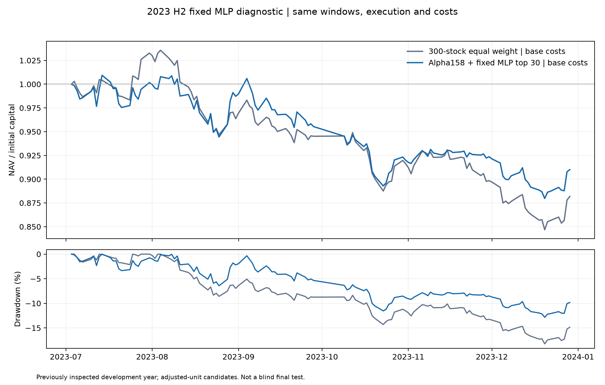

# Alpha158 + 固定 MLP：2023 年下半年诊断

固定 MLP 基线没有超过 LightGBM。2023-07-03 至 2023-12-29、同一成本和执行口径下：

| 组合 | 区间收益 | 年化收益 | 最大回撤 | Sharpe（无风险利率为 0） | 双边累计换手 |
| --- | ---: | ---: | ---: | ---: | ---: |
| 300 只条件成员等权 | -11.81% | -22.71% | 18.24% | -1.828 | 167.91% |
| Alpha158 + 固定 MLP top30 | **-9.00%** | -17.57% | **12.85%** | -1.331 | 3,577.36% |

MLP 相对同期等权改善 2.81 个百分点，但仍亏损；它比同一时间窗口的 LightGBM top30
常规成本结果 **-6.30%** 低 2.70 个百分点。固定 MLP 没有成为下一阶段基线。

| 成本场景 | 组合 | 区间收益 | 年化波动 | 最大回撤 | 费用加滑点 |
| --- | --- | ---: | ---: | ---: | ---: |
| 零成本 | 等权 | -11.35% | 13.58% | 17.95% | 0 元 |
| 零成本 | MLP top30 | **-5.27%** | 13.85% | **10.43%** | 0 元 |
| 常规成本 | 等权 | -11.81% | 13.58% | 18.24% | 49,540 元 |
| 常规成本 | MLP top30 | **-9.00%** | 13.81% | **12.85%** | **382,110 元** |
| 较高成本 | 等权 | -12.26% | 13.58% | 18.52% | 96,847 元 |
| 较高成本 | MLP top30 | **-11.59%** | 13.83% | 15.05% | **646,625 元** |

MLP 的全评估期平均 IC 为 0.048，平均 Rank IC 为 **0.067**；Rank IC 为正的交易日占
71.2%。Q3 平均 Rank IC 0.033，Q4 为 0.107。排序信号弱于 LightGBM（全期 Rank IC 0.108），
同时 MLP top30 的双边换手约为等权的 21.31 倍，成本后相对优势明显收窄。

配置固定于 [mlp-alpha158-2023-diagnostic.json](../configs/mlp-alpha158-2023-diagnostic.json)。
使用与 LightGBM 完全相同的 Qlib Alpha158 158 维特征、60 个交易日预热、
`open[t+6] / open[t+1] - 1` 标签、两个成熟标签窗口、top30 选择、次日开盘执行和三档成本。
MLP 架构为 `158 → 64 → 32 → 1`，ReLU、MSELoss、Adam，40 个 epoch、学习率 0.001、
权重衰减 0.0001、固定种子 20261005、CPU 单线程；特征缺失和无穷值固定替换为 0，
没有 early stopping 或参数搜索。

训练边界和 LightGBM 相同：Q3 拟合截止 2023-06-30，Q4 拟合截止 2023-09-28，
训练标签严格满足 `label_exit_index < evaluation_start_index`。独立审计重新加载两个模型，
确认模型预测、成熟边界、top30 成员、IC 端点及两种组合三档成本的每日现金、持仓和净值。
没有读取 2024–2025，也没有使用 GPU、网络或服务器。

该结果是开发诊断，不是盲测，也没有解除真实候选的正式 PIT、成员、公司行为、涨跌停、ST
和容量门禁。MLP 结果保留为负面基线；当前应优先处理历史数据认证与换手 / 成本约束，
而不是继续在这个 2023 区间盲目增加模型复杂度。

完整产物位于 `artifacts/experiments/diagnostic/mlp-alpha158-2023-h2-v1/`，包含特征、模型、
预测、标签、交易记录、净值、IC、运行 manifest 和审计结果。紧凑证据见
[mlp_alpha158_2023_acceptance.json](evidence/mlp_alpha158_2023_acceptance.json)。
